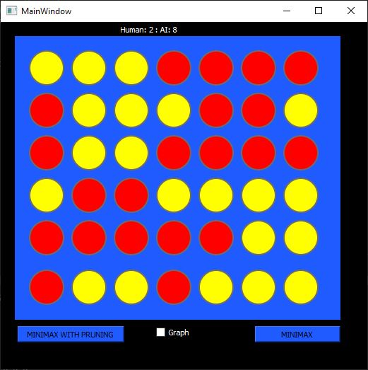

# Connect Four
## Description
This is a simple implementation of the game Connect Four. The game is played on a 7x6 board. A score is kept for each player. The game is played by two players, the computer and the user. The computer will always play first and is denoted by the colour red. The user will always play second and is denoted by the colour yellow. The user can click on any cell in the column to select their next move.

## Algorithm
The algorithm used to determine the computer's next move is a minimax algorithm with or without alpha-beta pruning. To select an algorithm, the user simply clicks on the corresponding button. The algorithm will then be used to determine the computer's next move. The user can also select the difficulty of the game by choosing a search depth. The search depth is the number of moves ahead the algorithm will search. The higher the search depth, the more difficult the game will be. 
## Game Tree
The user can choose to display the game tree on any turn by ticking the **graph** checkbox. An example of such a tree would be:

## Authors
- Haguar Tarek
- Manar Amgad
- Mariem Mostafa
- Nada Elwazane
